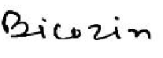
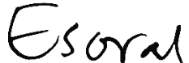

# Handwritten Drug Name Recognition (CRNN)

A deep learning project for recognizing handwritten drug names from word-level images using a CRNN (Convolutional Recurrent Neural Network). It addresses the real-world challenge of interpreting handwritten pharmaceutical terms from prescription-like inputs. Designed as a modular pipeline, the system focuses on word-level OCR, where each input is a single handwritten drug name, and demonstrates domain adaptation by fine-tuning a general OCR model on medical handwriting.

---

## 🚀 Demo

### Input → Prediction

| Image | Prediction |
|------|-----------|
|  | bicozin |
|  | esoral |

---

## 🧠 What this does

- Takes a **single handwritten word image**
- Uses a **CRNN model (CNN + LSTM)**
- Outputs the predicted drug name

---

## ⚙️ How to run

```bash
python predict.py
```

## Make sure these files are in the same folder:

- crnn_prescription.pth
- predict.py
- sample image (e.g., 150.png)

---

## 📁 Project Structure

```
crnn_prescription.pth   # trained model
predict.py              # inference script
medocr.ipynb            # training + fine-tuning
150.png                 # sample input
265.png                 # sample input
```
---

## 🧪 Training Details

- Model: CRNN (CNN + Bidirectional LSTM)
- Pre-training: IAM Handwriting Dataset (general handwritten text)
- Fine-tuning: Doctor’s handwritten prescription dataset (drug names)
- Objective: Recognize handwritten pharmaceutical terms from word-level images

---

## 📊 Dataset

The model was trained and fine-tuned on word-level handwritten data:

- Images of individual handwritten drug names  
- Corresponding text labels (CSV format)  
- Organized into training, validation, and testing splits  

---

## 🔧 Approach

1. Extract visual features using CNN  
2. Model sequential patterns using LSTM  
3. Use CTC loss for sequence prediction  
4. Fine-tune on medical data to adapt to drug-specific vocabulary  

---
